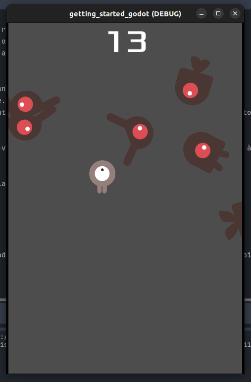

# Your First 2D Game - Godot

## Screenshots

## Descrição
Este projeto é um tutorial básico para iniciantes no desenvolvimento de jogos usando o Godot Engine. 
O tutorial aborda os conceitos fundamentais do Godot para criar um simples jogo 2D.

## Requisitos
- Godot Engine (versão 4.2.1 ou superior)

## Conteúdo
O projeto consiste nos seguintes arquivos e diretórios principais:

- **/art**: Contém os recursos do jogo, como sprites, áudio, etc.
- **/script**: Contém os scripts GDScript para lógica do jogo.
- **/scenes**: Contém as cenas do Godot.

## Como Iniciar
1. Clone ou faça o download do repositório.
2. Abra o Godot Engine.
3. Abra o projeto apontando para o arquivo `project.godot` no diretório do projeto.

## Contribuições
Contribuições são bem-vindas! Se você encontrar problemas ou melhorias, sinta-se à vontade para abrir uma issue ou enviar um pull request.

## Licença
Este projeto é licenciado sob a Licença MIT.

## Autor
Anderson Gomes

## Agradecimentos
Agradecemos à comunidade Godot e aos contribuidores do tutorial original que inspirou este projeto.

